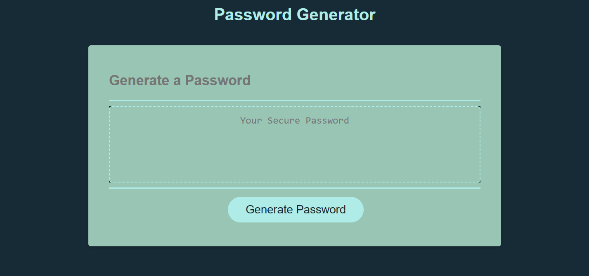

# Strong Password Generator

> A browser-based application that creates secure passwords using customizable criteria.

## Description
- I created this project so that people had access to a password generator they use to help improve their security. 

This project allows users to generate random passwords directly in their web browser. It prompts for a desired password length and whether to include lowercase, uppercase, numeric, and special characters. After answering the prompts, a password meeting those selections appears in the text area on the page.

## Installation & Setup

Visit the [Strong Password Generator website](https://davidtjgriffin.github.io/strong-password-generator/) to start generating passwords. No installation is required.

## Usage
On the website, click the **Generate Password** button:
- Enter a length between 8 and 128 characters.
- Confirm which character types to include.
- The generated password is displayed for you to copy.



Example:
```
Enter an integer for password length with at least 8 characters and no more than 128 characters
You choose a length of 12 characters.
Do you want lowercase letters in your password? OK
Do you want uppercase letters in your password? OK
Do you want numbers in your password? OK
Do you want special characters in your password? OK
```

## Tech Stack

- Language: JavaScript, HTML, CSS
- Tools: Browser / DOM API

## Future Improvements

- [ ] Persist generated passwords to local storage  
- [ ] Add a copy-to-clipboard button  
- [ ] Improve accessibility of prompts  

## Contributing

1. Fork the project  
2. Create a feature branch (`git checkout -b feature/my-feature`)  
3. Commit your changes (`git commit -m 'Add feature'`)  
4. Push to your branch (`git push origin feature/my-feature`)  
5. Open a Pull Request


Created by [David Griffin](https://github.com/DavidTJGriffin)

## License

MIT License

Copyright (c) 2025 David Griffin

Permission is hereby granted, free of charge, to any person obtaining a copy
of this software and associated documentation files (the "Software"), to deal
in the Software without restriction, including without limitation the rights
to use, copy, modify, merge, publish, distribute, sublicense, and/or sell
copies of the Software, and to permit persons to whom the Software is
furnished to do so, subject to the following conditions:

The above copyright notice and this permission notice shall be included in all
copies or substantial portions of the Software.

THE SOFTWARE IS PROVIDED "AS IS", WITHOUT WARRANTY OF ANY KIND, EXPRESS OR
IMPLIED, INCLUDING BUT NOT LIMITED TO THE WARRANTIES OF MERCHANTABILITY,
FITNESS FOR A PARTICULAR PURPOSE AND NONINFRINGEMENT. IN NO EVENT SHALL THE
AUTHORS OR COPYRIGHT HOLDERS BE LIABLE FOR ANY CLAIM, DAMAGES OR OTHER
LIABILITY, WHETHER IN AN ACTION OF CONTRACT, TORT OR OTHERWISE, ARISING FROM,
OUT OF OR IN CONNECTION WITH THE SOFTWARE OR THE USE OR OTHER DEALINGS IN THE
SOFTWARE.


